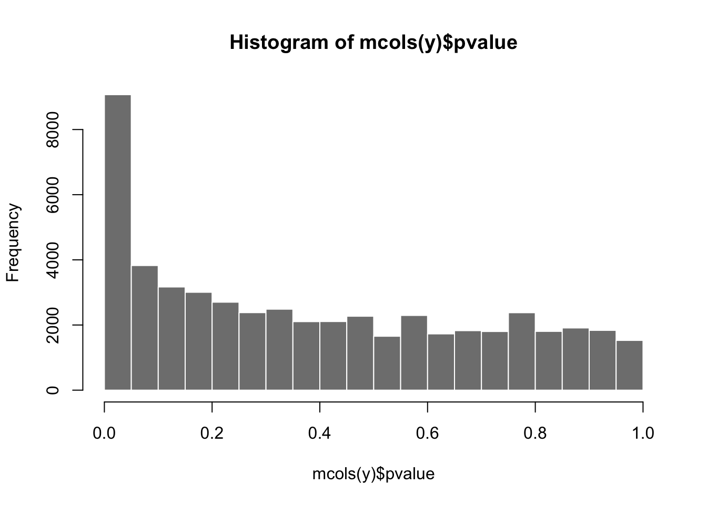
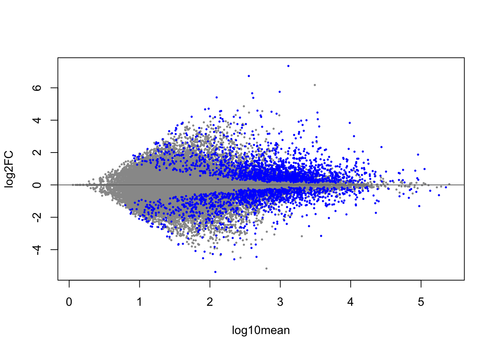
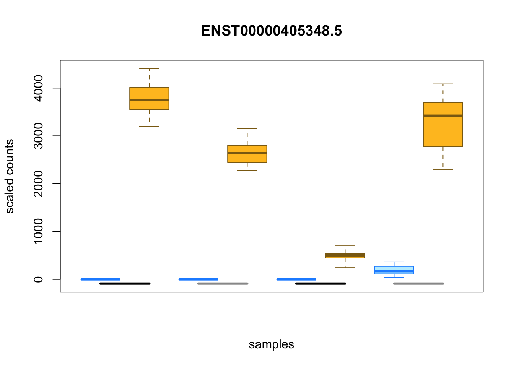
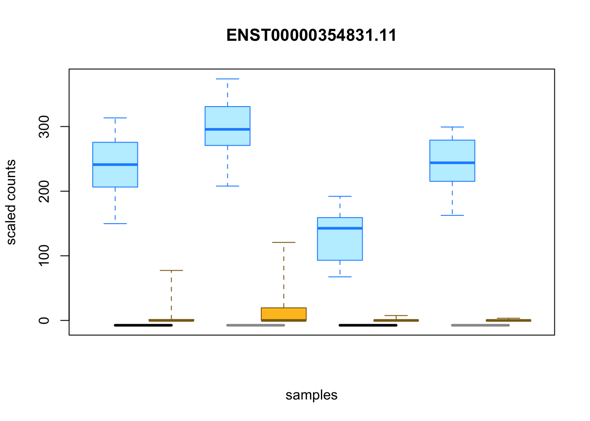
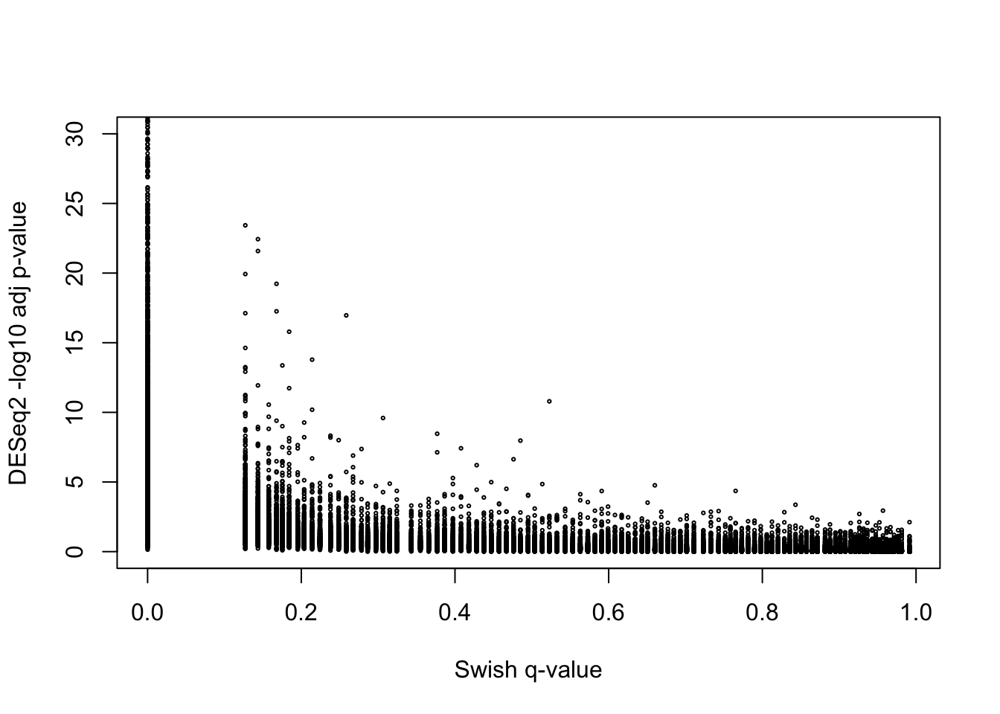
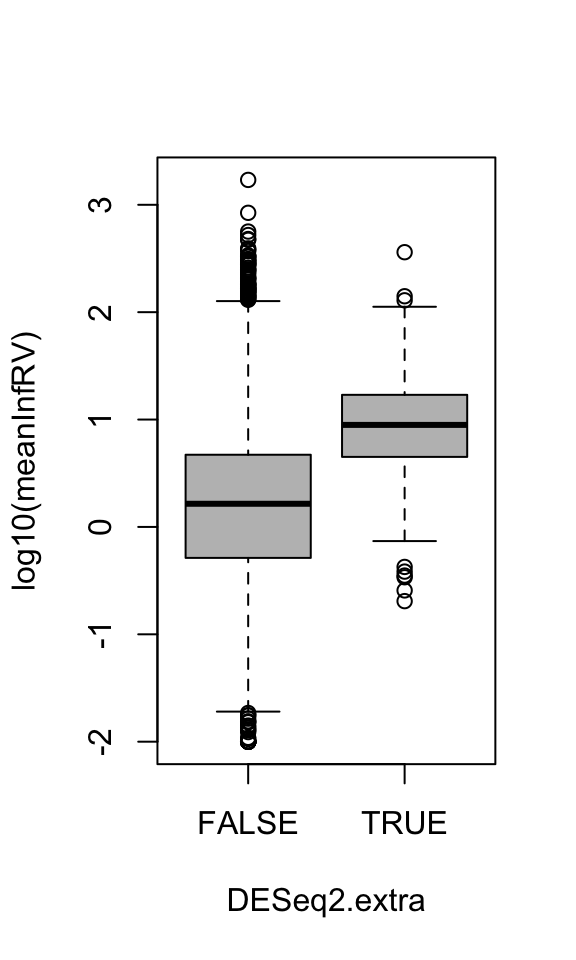
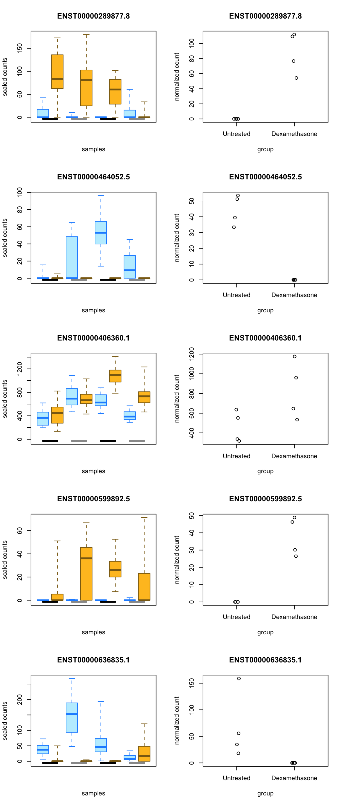
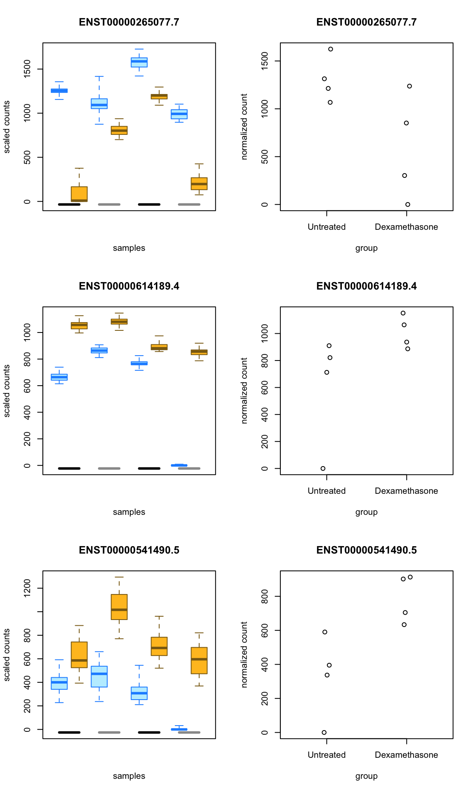

In this short tutorial, we will analyze the *airway* dataset using the
Swish non-parametric method for differential expression. In particular
we will look for DTE (differential transcript expression), in response
to treatment with dexamethasone, controlling for differences at
baseline across four donors. More information on the *airway* dataset
can be found [here](http://bioconductor.org/packages/airway). The
Swish method is described
in [this paper](https://doi.org/10.1093/nar/gkz622). 

To use Swish, one needs to have quantified RNA-seq reads, including
the generation of inferential replicate counts, and then imported this
data into R/Bioconductor. All the packages listed here (except
`airway2`) can be installed from Bioconductor using, e.g.:

```
BiocManager::install(c("tximeta","fishpond"))
```

### tximeta to import quantification files

We have quantified the data using *Salmon* with 20 Gibbs samples that
will serve as inferential replicates. The Gibbs samples were generated
because we used the argument `--numGibbsSamples 20`.

We used *Snakemake* to run the jobs, and the exact Snakemake command
that was used can be found here: 

<https://github.com/mikelove/airway2/blob/master/inst/extdata/Snakefile>

Now we import the data into R/Bioconductor using *tximeta*. 

If you want to follow along, the quantification files have been
uploaded to GitHub in the following repository:

<https://github.com/mikelove/airway2>

So in our case the quantification files and a plaintext file with
the information about the samples are located within the following
directory. 


```r
dir <- "airway2/inst/extdata"
sra <- read.delim(file.path(dir,"SraRunTable.txt"))
sra[1:3,]
```

```
##   AvgSpotLen    BioSample Experiment MBases MBytes        Run SRA_Sample
## 1        126 SAMN02422669  SRX384345   2756   1588 SRR1039508  SRS508568
## 2        126 SAMN02422675  SRX384346   2542   1480 SRR1039509  SRS508567
## 3        126 SAMN02422678  SRX384349   3380   2055 SRR1039512  SRS508571
##   Sample_Name cell_line ercc_mix     treatment Assay_Type  BioProject
## 1  GSM1275862    N61311        -     Untreated    RNA-Seq PRJNA229998
## 2  GSM1275863    N61311        - Dexamethasone    RNA-Seq PRJNA229998
## 3  GSM1275866   N052611        -     Untreated    RNA-Seq PRJNA229998
##   Center_Name Consent DATASTORE_filetype DATASTORE_provider InsertSize
## 1         GEO  public                sra               ncbi          0
## 2         GEO  public                sra               ncbi          0
## 3         GEO  public                sra               ncbi          0
##            Instrument LibraryLayout LibrarySelection  LibrarySource
## 1 Illumina HiSeq 2000        PAIRED             cDNA TRANSCRIPTOMIC
## 2 Illumina HiSeq 2000        PAIRED             cDNA TRANSCRIPTOMIC
## 3 Illumina HiSeq 2000        PAIRED             cDNA TRANSCRIPTOMIC
##     LoadDate     Organism Platform ReleaseDate SRA_Study
## 1 2013-11-26 Homo sapiens ILLUMINA  2014-01-02 SRP033351
## 2 2013-11-26 Homo sapiens ILLUMINA  2014-01-02 SRP033351
## 3 2013-11-26 Homo sapiens ILLUMINA  2014-01-02 SRP033351
##                    cell_type                source_name
## 1 airway smooth muscle cells airway smooth muscle cells
## 2 airway smooth muscle cells airway smooth muscle cells
## 3 airway smooth muscle cells airway smooth muscle cells
##                             tissue
## 1 human airway smooth muscle cells
## 2 human airway smooth muscle cells
## 3 human airway smooth muscle cells
```

(The `inst/extdata` part of the path above is specific to how data is
stored in an R package, `airway2` being an R package. However there's
no need to have this directory structure in a typical data analysis.)

The only step needed to run *tximeta* is to make a *data.frame* that
has two or more columns. It must have a column `files` that points to
the `quant.sf` files, and it must have a column `names` with the names
for the samples. Additional columns will describe the samples
(e.g. condition, batch, donor, etc.).


```r
files <- file.path(dir,"quants",sra$Run,"quant.sf")
lvls <- c("Untreated", "Dexamethasone")
coldata <- data.frame(
  files=files,
  names=sra$Run,
  donor=sra$cell_line,
  condition=factor(sra$treatment, lvls)
)
coldata[1:3,]
```

```
##                                             files      names   donor
## 1 airway2/inst/extdata/quants/SRR1039508/quant.sf SRR1039508  N61311
## 2 airway2/inst/extdata/quants/SRR1039509/quant.sf SRR1039509  N61311
## 3 airway2/inst/extdata/quants/SRR1039512/quant.sf SRR1039512 N052611
##       condition
## 1     Untreated
## 2 Dexamethasone
## 3     Untreated
```

We need to load the following R packages for this script:


```r
library(tximeta)
library(fishpond) # for the Swish method
suppressPackageStartupMessages(library(SummarizedExperiment))
```

Now we load in the quantification data:


```r
se <- tximeta(coldata)
```

```
## importing quantifications
```

```
## reading in files with read_tsv
```

```
## 1 2 3 4 5 6 7 8 
## found matching linked transcriptome:
## [ Gencode - Homo sapiens - release 29 ]
## loading existing TxDb created: 2019-02-11 14:22:51
## Loading required package: GenomicFeatures
## Loading required package: AnnotationDbi
## loading existing transcript ranges created: 2019-05-31 20:37:15
## fetching genome info
```

### Running Swish to detect DTE

The following lines perform the Swish analysis on the transcript
level. The `quiet=TRUE` is just to suppress the progress bar in the R
output. 


```r
y <- se
y <- scaleInfReps(y, quiet=TRUE)
y <- labelKeep(y)
y <- y[ mcols(y)$keep, ]
set.seed(1) # for reproducibility
y <- swish(y,
           x="condition", # the condition to compare
           pair="donor", # within donor pairs
           nperms=16, # default is 30 perms
           quiet=TRUE)
```

Two special notes about the `swish` call above: 

1. If we had two groups with no donor information, we would just leave
   out the `pair` argument. If we had batches, we would use `cov`
   instead of `pair` to denote the batch indicator.
2. Here we have only `2^4 = 16` possible permutations. We will see this is
   sufficient to detect many DE transcripts. If we had 3 paired
   samples, it likely would not provide sufficient permutations to
   detect DE transcripts. In general, the Swish default is to use 30 
   permutations on paired or unpaired data (30 permutations are used
   if `nperms` isn't specified, and this was the setting evaluated in
   the Swish paper).

Now we can examine the p-value distribution. It's important that a
method have a "well-behaved" p-value distribution in order for the
false discovery rate to be properly controlled by the p-value
adjustment method (necessary but not sufficient). Given that a dataset
has a mix of some features with small or no changes across condition,
and some features with changes that can be estimated with relative
precision, the set of features with small or no changes will produce
uniform bars from 0 to 1, and then --- if there are features which are
DE --- we should also see an enrichment of small p-values on the left
side of the histogram.


```r
hist(mcols(y)$pvalue, col="grey50", border="white")
```



It's useful to examine an MA plot, where the blue points indicate a
nominal FDR bound of 5%. For more details on annotating the MA plot
with identifiers, see the 
[Swish vignette](https://bioconductor.org/packages/fishpond).


```r
plotMASwish(y)
```



We can tabulate the significant transcripts at a nominal 5% FDR by the
sign of the log2 fold change:


```r
with(mcols(y),
     table(sig=qvalue < .05, sign.lfc=sign(log2FC))
     )
```

```
##        sign.lfc
## sig        -1     0     1
##   FALSE 26754    25 22275
##   TRUE   1155     0  1672
```

We create two rankings of the transcripts, the significant
down-regulated transcripts (`lo`) and the significant up-regulated
transcripts (`hi`), each ranked by the LFC. We will create two vectors
which give the _row number_ of the down- and up-regulated transcripts.
The `order` function ranks from small to large so for `lo` we multiply
the LFC by an indicator if the transcript is significant. For `hi` we
flip the sign and do the same:


```r
sig <- mcols(y)$qvalue < .05
lo <- order(mcols(y)$log2FC * sig)
hi <- order(-mcols(y)$log2FC * sig)
```

We can now use `lo` and `hi` to look at the top transcripts. If we
want to restrict to only the significant ones, we can chop these
ranked row number vectors:


```r
lo <- head(lo, sum(sig & mcols(y)$log2FC < 0))
hi <- head(hi, sum(sig & mcols(y)$log2FC > 0))
```

The top up-regulated and down-regulated transcripts can be plotted
with inferential replicate data shown as boxes in a boxplot. The
orange boxes represent the dexamethasone treated samples, and the blue
are the untreated. Again the boxes show the range of the inferential
replicates for each sample for this transcript. They are grouped by
donor pair (alternating black and grey bars at the bottom of the plot
indicate pairs): 


```r
plotInfReps(y, idx=hi[1], x="condition", cov="donor", xaxis=FALSE)
```



```r
plotInfReps(y, idx=lo[1], x="condition", cov="donor", xaxis=FALSE)
```



(The `xaxis=FALSE` argument here suppresses the numbering of samples
on the x-axis, the numbers being more useful for when there are
biological replicates.)

### Comparison with DESeq2 at transcript level

In the [Swish paper](https://doi.org/10.1093/nar/gkz622), we find that
for DTE, across a range of sample sizes from n=4 to n=20 per group,
Swish outperforms other popular methods in terms of sensitivity while
controlling FDR across transcripts, even for those transcripts with
high inferential uncertainty. DESeq2, which was designed for
gene-level observed counts, tended to have too high FDR for those
transcripts with high inferential uncertainty (which makes sense as
this and other such methods do not make use of any information about
inferential uncertainty coming from the quantification method).

Here we also run DESeq2 and examine transcripts for which DESeq2 gives
a very small adjusted p-value, while Swish does not. The equivalent
DESeq2 design formula for the above `swish` call is `~donor +
condition`: 


```r
library(DESeq2)
dds <- DESeqDataSet(se, ~donor + condition)
```

```
## using counts and average transcript lengths from tximeta
```

```r
dds <- dds[rownames(y),]
dds <- DESeq(dds, fitType="local", quiet=TRUE)
res <- results(dds)
```

We can compare the number of transcripts at the nominal 5% FDR threshold:


```r
table(deseq2=res$padj < .05, swish=sig)
```

```
##        swish
## deseq2  FALSE  TRUE
##   FALSE 43809   101
##   TRUE   3246  2713
```

DESeq2 is calling more than double the number of transcripts that
Swish is calling. There are also a minority of transcripts
that Swish calls but not DESeq2. We found that Swish had comparable
power to parametric methods even at n=4 samples per group, so likely
some of the excess of calls from DESeq2 could be from transcripts with
high inferential uncertainty.

Another factor is that we only have 4 paired samples, and so Swish is
likely calling only those transcripts in which all 4 paired samples
demonstrated a _consistent_ change upon treatment, whereas DESeq2 may
call some transcripts with large changes in a subset of the 4 pairs,
and small or no change for the other pairs. Swish is based on the
SAMseq method, which had the appropriate publication title 
"Finding consistent patterns: A nonparametric approach for identifying
differential expression in RNA-Seq data" --
[Li and Tibshirani (2011)](https://www.ncbi.nlm.nih.gov/pmc/articles/PMC4605138/).

We will now take a look at some of the outlier transcripts in the
following plot, which have a very small adjusted p-value from DESeq2
but a mid range q-value from Swish:


```r
plot(mcols(y)$qvalue, -log10(res$padj), ylim=c(0,30),
     xlab="Swish q-value", ylab="DESeq2 -log10 adj p-value", cex=.3)
```



```r
DESeq2.extra <- res$padj < 1e-2 & mcols(y)$qvalue > .2
table(DESeq2.extra)
```

```
## DESeq2.extra
## FALSE  TRUE 
## 49451   475
```

To demonstrate that some extra calls from DESeq2 have elevated
inferential uncertainty, we compute the Inferential Relative Variance
(InfRV) as defined in the Swish paper. It is defined as `(var -
mean)/mean` over the inferential replicates for a given sample, with
some parameters to keep the value positive and bounded for small
`mean`. Below we plot the mean of InfRV over samples, then group the
transcripts by whether they were in `DESeq2.extra`.


```r
y <- computeInfRV(y)
with(mcols(y), boxplot(log10(meanInfRV) ~ DESeq2.extra, col="grey"))
```



To demonstrate that some of the DESeq2 calls are for transcripts where
not all the 4 pairs have consistent effects from treatment, we can
construct the following contingency tables, showing that all of the
Swish calls have all 4 pairs in the same direction according to a
simple calculation of LFC, however DESeq2 has ~500 DTE calls which do
not have consistent sign of LFC across the 4 pairs.


```r
n.cts <- counts(dds, normalized=TRUE)
lfc <- log2(n.cts[,c(2,4,6,8)] + 1) - log2(n.cts[,c(1,3,5,7)] + 1)
consistent <- apply(lfc, 1, function(x) all(sign(x) == sign(x[1])))
table(consistent, Swish=sig)
```

```
##           Swish
## consistent FALSE  TRUE
##      FALSE 38289     0
##      TRUE  10765  2827
```

```r
table(consistent, DESeq2=res$padj < .05)
```

```
##           DESeq2
## consistent FALSE  TRUE
##      FALSE 35995   519
##      TRUE   7915  5440
```

Note that if we had larger numbers of pairs, it would not necessarily
be the case that _all_ of the Swish calls would have consistent sign of
LFC for _all_ the pairs. However, with only 4 pairs, we see that this
happened to be the case, for this dataset.

If we look at 5 particular transcripts with very low adjusted p-value
from DESeq2 and a high q-value from Swish, we see that the inferential
replicates are helping to avoid calling these transcripts as
significant. These may represent cases where a transcript is not
actually expressed, but instead the quantification method is not sure
where to place the reads among this and other similar transcripts. At
the least, we would need more samples with less uncertainty on the
quantification (higher sequencing depth, more uniform coverage, longer
reads) in order to be sure that these transcripts are truly DE, and
not false positives for DESeq2.


```r
idx <- which(res$padj < 1e-5 & mcols(y)$qvalue > .4)
par(mfrow=c(5,2))
for (i in 1:5) {
  plotInfReps(y, idx=idx[i], x="condition", cov="donor", xaxis=FALSE)
  plotCounts(dds, gene=idx[i], "condition", transform=FALSE)
}
```



We can also examine some of the transcripts where Swish calls them as
DE but DESeq2 does not. The general pattern seems to be that for one
pair, the effect is much larger than for the other three pairs. For
paired data, Swish focuses on the sign of the treatment effect, and
whether this is stable across inferential replicates. So it is less
sensitive to whether the log fold change is nearly the same across all 
donors, and more sensitive to the direction of the effect and whether
it is consistent across samples and inferential replicates.


```r
idx <- which(mcols(y)$qvalue < .05 & res$padj > .5)
par(mfrow=c(3,2))
for (i in 1:3) {
  plotInfReps(y, idx=idx[i], x="condition", cov="donor", xaxis=FALSE)
  plotCounts(dds, gene=idx[i], "condition", transform=FALSE)
}
```



### More details

For more details, consult the 
[Swish vignette](https://bioconductor.org/packages/fishpond).
as well as the help pages for individual functions, e.g. `?swish`. You
can also post questions to the  
[Bioconductor support site](https://support.bioconductor.org),
always making sure to post your code.

### Session info


```r
sessionInfo()
```

```
## R version 3.6.0 (2019-04-26)
## Platform: x86_64-apple-darwin15.6.0 (64-bit)
## Running under: macOS Mojave 10.14.6
## 
## Matrix products: default
## BLAS:   /Library/Frameworks/R.framework/Versions/3.6/Resources/lib/libRblas.0.dylib
## LAPACK: /Library/Frameworks/R.framework/Versions/3.6/Resources/lib/libRlapack.dylib
## 
## locale:
## [1] en_US.UTF-8/en_US.UTF-8/en_US.UTF-8/C/en_US.UTF-8/en_US.UTF-8
## 
## attached base packages:
## [1] stats4    parallel  stats     graphics  grDevices datasets  utils    
## [8] methods   base     
## 
## other attached packages:
##  [1] DESeq2_1.25.5               GenomicFeatures_1.37.3     
##  [3] AnnotationDbi_1.47.0        SummarizedExperiment_1.15.5
##  [5] DelayedArray_0.11.2         BiocParallel_1.19.0        
##  [7] matrixStats_0.54.0          Biobase_2.45.0             
##  [9] GenomicRanges_1.37.14       GenomeInfoDb_1.21.1        
## [11] IRanges_2.19.10             S4Vectors_0.23.17          
## [13] BiocGenerics_0.31.4         fishpond_1.1.12            
## [15] tximeta_1.3.6               testthat_2.1.1             
## [17] rmarkdown_1.13              usethis_1.5.0              
## [19] devtools_2.0.2             
## 
## loaded via a namespace (and not attached):
##   [1] colorspace_1.4-1         rprojroot_1.3-2         
##   [3] htmlTable_1.13.1         XVector_0.25.0          
##   [5] base64enc_0.1-3          fs_1.3.1                
##   [7] rstudioapi_0.10          remotes_2.1.0           
##   [9] bit64_0.9-7              codetools_0.2-16        
##  [11] splines_3.6.0            tximport_1.13.8         
##  [13] geneplotter_1.63.0       knitr_1.23              
##  [15] pkgload_1.0.2            Formula_1.2-3           
##  [17] jsonlite_1.6             Rsamtools_2.1.2         
##  [19] annotate_1.63.0          cluster_2.1.0           
##  [21] dbplyr_1.4.2             compiler_3.6.0          
##  [23] httr_1.4.0               backports_1.1.4         
##  [25] assertthat_0.2.1         Matrix_1.2-17           
##  [27] lazyeval_0.2.2           cli_1.1.0               
##  [29] acepack_1.4.1            htmltools_0.3.6         
##  [31] prettyunits_1.0.2        tools_3.6.0             
##  [33] gtable_0.3.0             glue_1.3.1              
##  [35] GenomeInfoDbData_1.2.1   dplyr_0.8.1             
##  [37] rappdirs_0.3.1           Rcpp_1.0.1              
##  [39] Biostrings_2.53.0        rtracklayer_1.45.1      
##  [41] xfun_0.8                 stringr_1.4.0           
##  [43] ps_1.3.0                 ensembldb_2.9.2         
##  [45] gtools_3.8.1             XML_3.98-1.20           
##  [47] zlibbioc_1.31.0          scales_1.0.0            
##  [49] hms_0.4.2                ProtGenerics_1.17.2     
##  [51] AnnotationFilter_1.9.0   RColorBrewer_1.1-2      
##  [53] yaml_2.2.0               curl_3.3                
##  [55] memoise_1.1.0            gridExtra_2.3           
##  [57] ggplot2_3.2.0            biomaRt_2.41.3          
##  [59] rpart_4.1-15             latticeExtra_0.6-28     
##  [61] stringi_1.4.3            RSQLite_2.1.1           
##  [63] genefilter_1.67.1        desc_1.2.0              
##  [65] checkmate_1.9.3          pkgbuild_1.0.3          
##  [67] rlang_0.4.0              pkgconfig_2.0.2         
##  [69] bitops_1.0-6             evaluate_0.14           
##  [71] lattice_0.20-38          purrr_0.3.2             
##  [73] GenomicAlignments_1.21.4 htmlwidgets_1.3         
##  [75] bit_1.1-14               processx_3.3.1          
##  [77] tidyselect_0.2.5         magrittr_1.5            
##  [79] R6_2.4.0                 Hmisc_4.2-0             
##  [81] DBI_1.0.0                pillar_1.4.2            
##  [83] foreign_0.8-71           withr_2.1.2             
##  [85] abind_1.4-5              survival_2.44-1.1       
##  [87] RCurl_1.95-4.12          nnet_7.3-12             
##  [89] tibble_2.1.3             crayon_1.3.4            
##  [91] BiocFileCache_1.9.1      progress_1.2.2          
##  [93] locfit_1.5-9.1           grid_3.6.0              
##  [95] data.table_1.12.2        blob_1.1.1              
##  [97] callr_3.2.0              digest_0.6.19           
##  [99] xtable_1.8-4             munsell_0.5.0           
## [101] sessioninfo_1.1.1
```
